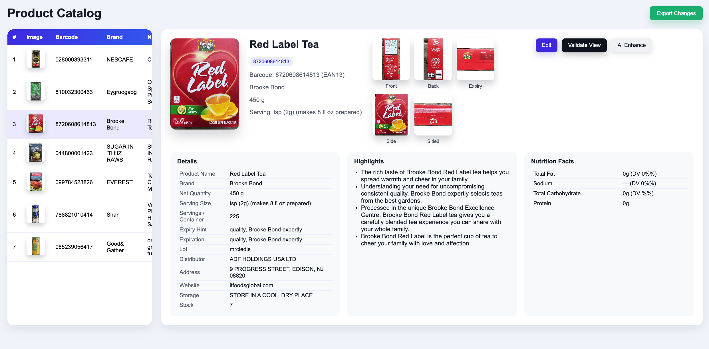

# Automatic Product Creator for POS/ERP

Turn raw product photos into structured catalog data and e‑commerce‑ready hero images with a single Python script. The pipeline detects product regions, reads packaging text, masks backgrounds, and exports JSON plus white‑background hero crops.

## Features
- YOLO‑World open‑vocabulary detection (products, labels, barcodes, etc.)
- EasyOCR line extraction with red overlay previews
- Masked “text‑only” preview to focus on readable regions
- Hero crops and cutouts on pure white backgrounds
- Barcode reads (ZXing‑CPP / pyzbar fallback)
- Combined JSON per product with summaries, dates, MRP, barcodes, ingredients, claims, and nutrition facts
- Optional LLM assist (OpenAI) to structure/enhance outputs
- Optional product API upsert via `PRODUCT_API_URL`

## Quick start
1) **Requirements**  
   - Python 3.11+  
   - System zbar (for barcodes): `brew install zbar` (macOS) or your distro’s package  
   - GPU optional; CPU works (slower)

2) **Install deps**  
```bash
pip install -r requirements.txt
```

3) **Add images**  
Place product photos under `input/products/<product_name>/` (one folder per product, up to 6 images). Example: `input/products/my_product/image1.jpg`.

4) **Run**  
```bash
python ocr_pipeline.py
```
Artifacts will appear in `output/`.

## Outputs
For each image you’ll see:
- `<stem>_detect.jpeg` — YOLO boxes
- `<stem>_ocr.jpeg` — OCR boxes/confidence
- `<stem>_masked.jpeg` — non‑text whited out (when OCR lines exist)
- `<stem>_hero.jpeg` — square crop on white
- `<stem>_hero_cutout.jpeg` — background‑removed square (if OpenCV available)
- `<stem>.json` — detections, OCR, barcodes, timings, output paths

For each product folder you’ll also get a combined JSON plus `output/catalog.json` and `output/catalog.html` for browsing results.

### Example combined JSON snippet
```json
{
  "summary": {
    "product_name": "Red Label Tea",
    "brand": "Brooke Bond",
    "net_weight": "450 g",
    "serving_size": "tsp (2g)",
    "expiry": "2025-06-15"
  },
  "barcode": {
    "items": [
      { "type": "EAN13", "data": "8720608614813" }
    ]
  },
  "mrp": { "amount": "299", "currency": "₹", "raw": "MRP ₹299.00 (incl. of all taxes)" },
  "dates": {
    "best_by": "2025-06-15",
    "raw_candidates": ["MFD 15/06/2024", "EXP 15/06/2025", "LOT A1B2C3"]
  },
  "views": {
    "front": { "hero": "output/product_front_hero.jpeg", "ocr": "output/product_front_ocr.jpeg" },
    "back":  { "hero": "output/product_back_hero.jpeg",  "ocr": "output/product_back_ocr.jpeg" }
  }
}
```

## Configuration (env vars)
- `MAX_SIDE` (default `2000`) — resize longest side before inference  
- `YOLO_MODEL` (default `yolov8m-world.pt`)  
- `YOLO_CONF` (default `0.25`) / `YOLO_IOU` (default `0.45`)  
- `YOLO_CLASSES` — comma‑separated prompts  
- `OCR_LANGS` (default `en`)  
- `HERO_SIZE` (default `1024`)  
- `CUT_PAD_PCT` (default `0.06`), `CUT_ITERS` (default `5`)  
- `PRODUCT_API_URL` — POST combined products to `<url>/products`  
- `OPENAI_API_KEY` — enables LLM structuring/enhancement (leave empty to skip)

## Repo hygiene
- `output/`, `input/`, `node_modules/`, caches, and editor files are git‑ignored to avoid noise and large assets.
- Sample only: `samples/output_sample.json` shows the combined output shape without shipping real data.
- Secrets: `OPENAI_API_KEY` is **not** hardcoded; set it in your environment if you use LLM features.

## How it works (high level)
1. Downscale image to `MAX_SIDE` if needed.  
2. Run YOLO‑World detections and EasyOCR lines.  
3. Build overlays and masked preview; read barcodes.  
4. Pick the best product box → hero and cutout crops.  
5. Extract anchor info (dates/MRP) and heuristic summary.  
6. (Optional) Send JSONs to OpenAI for structured output.  
7. Write per‑image JSONs, combined product JSON, and catalog HTML.

## Showcase
- Product catalog UI (catalog HTML with hero/JSON preview):  
  
- AI email/resume automation dashboard (My-Email-MCP):  
  

## Notes
- If no product‑like box is found, hero images may be skipped (noted in JSON).  
- If OpenCV is missing, the cutout hero is skipped (noted in JSON).  
- OCR‑dependent outputs are omitted when no lines are detected.

## Suggested GitHub topics
- `computer-vision`, `ocr`, `yolo`, `easyocr`, `openai`, `fastapi`, `pgvector`, `commerce`, `product-catalog`
